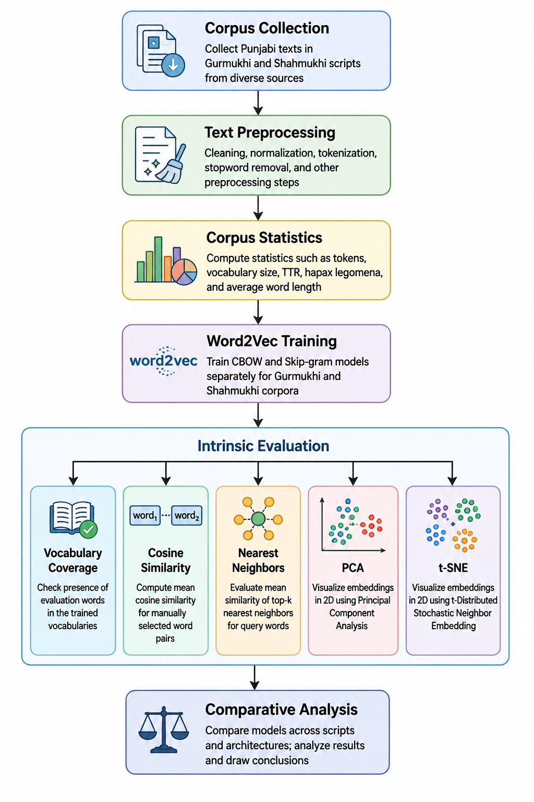

# Developing and Analyzing Punjabi Corpora in Gurmukhi and Shahmukhi Scripts: A Comparative Analysis of Word Embeddings for Low-Resource NLP

Official implementation accompanying the research paper:

> **Developing and Analyzing Punjabi Corpora in Gurmukhi and Shahmukhi Scripts: A Comparative Analysis of Word Embeddings for Low-Resource NLP**

---

## Workflow

<p align="center">
  
</p>

**Figure 1.** Overall workflow of corpus construction, preprocessing, Word2Vec training, intrinsic evaluation, and comparative analysis.

---

# Project Overview

Punjabi is one of the world's most widely spoken languages but remains underrepresented in Natural Language Processing (NLP), particularly because it is written in two distinct writing systems: **Gurmukhi** (India) and **Shahmukhi** (Pakistan).

This repository contains the complete implementation used in our comparative study of distributed word representations for Punjabi. We construct comparable corpora for both writing systems, train Word2Vec models using the CBOW and Skip-gram architectures, and evaluate their semantic quality using multiple intrinsic evaluation methods.

The project aims to provide reproducible baseline resources for Punjabi NLP and support future research on low-resource and multi-script languages.

---

# Key Contributions

- Comparative analysis of Punjabi corpora in Gurmukhi and Shahmukhi.
- Unified preprocessing pipeline for both writing systems.
- Training of Word2Vec CBOW and Skip-gram models under identical hyperparameters.
- Intrinsic evaluation using:
  - Vocabulary coverage
  - Cosine similarity
  - Nearest-neighbor analysis
  - Principal Component Analysis (PCA)
  - t-distributed Stochastic Neighbor Embedding (t-SNE)
- Public release of the implementation, notebooks, evaluation scripts, and trained models.

---

# Repository Structure

```
Punjabi-LowResource-NLP/
│
├── notebooks/
│   ├── 01_corpus_statistics.ipynb
│   ├── 02_train_word2vec.ipynb
│   ├── 03_embedding_analysis.ipynb
│   └── 04_intrinsic_embedding_evaluation.ipynb
│
├── figures/
│   ├── workflow.png
│   ├── pca_visualization.png
│   ├── tsne_visualization.png
│   └── tables/
│
├── results/
│   ├── evaluation_tables.csv
│   ├── cosine_similarity.csv
│   └── nearest_neighbors.csv
│
├── requirements.txt
├── LICENSE
├── CITATION.cff
└── README.md
```

---

# Experimental Configuration

| Parameter | Value |
|------------|-------|
| Embedding Algorithm | Word2Vec |
| Architectures | CBOW, Skip-gram |
| Vector Dimension | 200 |
| Context Window | 5 |
| Minimum Word Frequency | 5 |
| Training Epochs | 15 |
| Implementation | Gensim |
| Programming Language | Python |

---

# Trained Models

The trained Word2Vec models are publicly available through Hugging Face.

**Hugging Face Repository**

👉 https://huggingface.co/Wardatariqwt/Punjabi-Word2Vec-Embeddings

The repository contains:

- Gurmukhi CBOW
- Gurmukhi Skip-gram
- Shahmukhi CBOW
- Shahmukhi Skip-gram

---

# Data Availability

The Punjabi corpora used in this study were compiled from multiple publicly available textual resources.

Because the original source materials may be subject to different copyright or licensing conditions, the raw corpora are **not redistributed** through this repository.

This repository provides all code, preprocessing scripts, notebooks, evaluation scripts, and trained embedding models required to reproduce the reported experiments.

---

# Getting Started

Clone the repository:

```bash
git clone https://github.com/warda-tariqq/Punjabi-LowResource-NLP.git
```

Move into the project directory:

```bash
cd Punjabi-LowResource-NLP
```

Install the required packages:

```bash
pip install -r requirements.txt
```

---

# Running the Experiments

Run the notebooks in the following order:

1. `01_corpus_statistics.ipynb`
2. `02_train_word2vec.ipynb`
3. `03_embedding_analysis.ipynb`
4. `04_intrinsic_embedding_evaluation.ipynb`

These notebooks reproduce the complete experimental pipeline reported in the paper.

---

# Requirements

Main dependencies include:

- Python 3.10+
- Gensim
- NumPy
- Pandas
- Matplotlib
- Scikit-learn
- Jupyter Notebook

Install all dependencies using:

```bash
pip install -r requirements.txt
```

---

# Results

The study compares four Word2Vec models:

| Model | Script | Architecture |
|------|------|------|
| Gurmukhi CBOW | Gurmukhi | CBOW |
| Gurmukhi Skip-gram | Gurmukhi | Skip-gram |
| Shahmukhi CBOW | Shahmukhi | CBOW |
| Shahmukhi Skip-gram | Shahmukhi | Skip-gram |

Evaluation includes:

- Vocabulary Coverage
- Cosine Similarity
- Nearest Neighbor Analysis
- PCA Visualization
- t-SNE Visualization

Experimental outputs are available inside the **results/** directory.

---

# Reproducibility

To ensure reproducibility, all experiments were conducted using:

- identical preprocessing procedures
- identical Word2Vec hyperparameters
- identical evaluation protocols
- a unified experimental pipeline

The implementation is fully reproducible using the notebooks provided in this repository.

---

# Citation

If you use this repository in your research, please cite:

```bibtex
@article{tariq2026punjabi,
  title={Developing and Analyzing Punjabi Corpora in Gurmukhi and Shahmukhi Scripts: A Comparative Analysis of Word Embeddings for Low-Resource NLP},
  author={Tariq, Warda},
  year={2026}
}
```

The citation will be updated with DOI and publication details upon acceptance.

---

# Contact

**Warda Tariq**

PhD Researcher  
Faculty of Computer Science  
HSE University, Moscow

GitHub:
https://github.com/warda-tariqq

Hugging Face:
https://huggingface.co/Wardatariqwt

---

# License

This project is released under the **MIT License**.

See the LICENSE file for details.

---

## Acknowledgements

This work contributes reproducible baseline resources for Punjabi NLP and supports ongoing research in low-resource languages, multilingual NLP, and computational linguistics.

If you find this repository useful, please consider ⭐ starring the repository.
